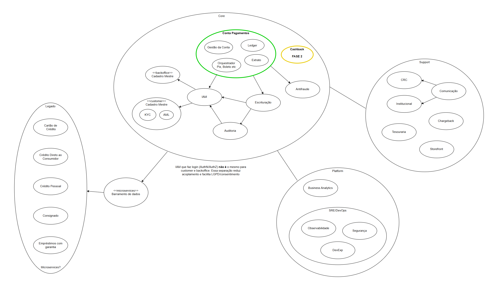
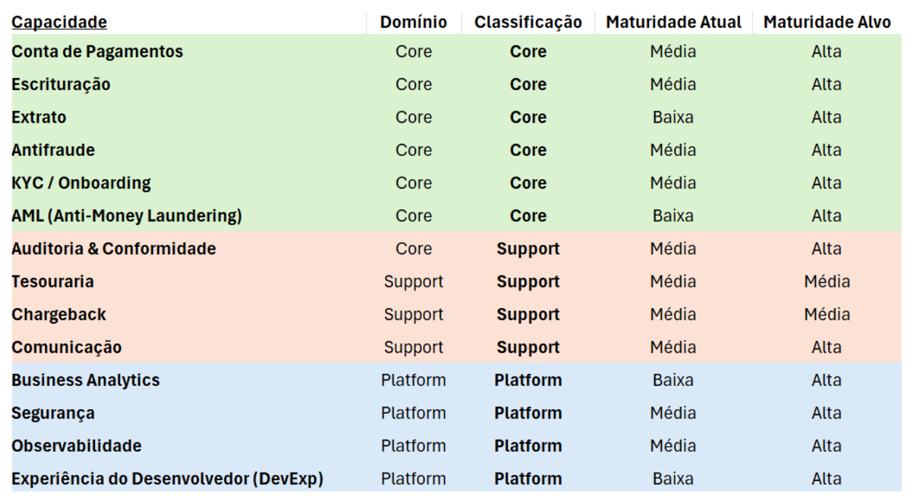
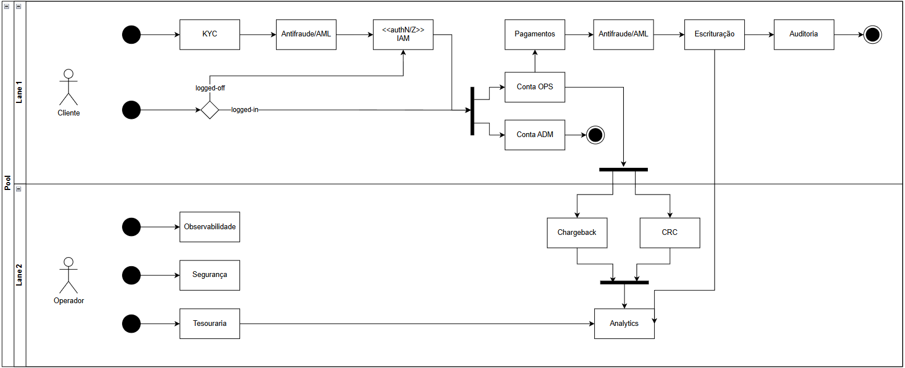
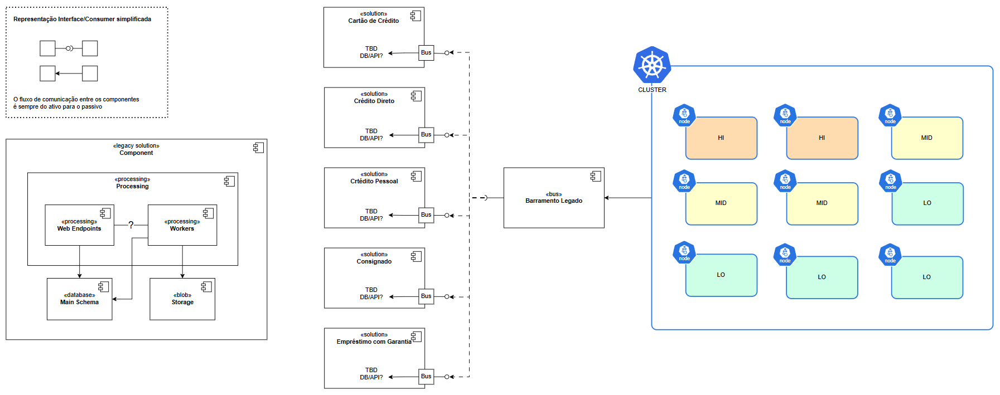
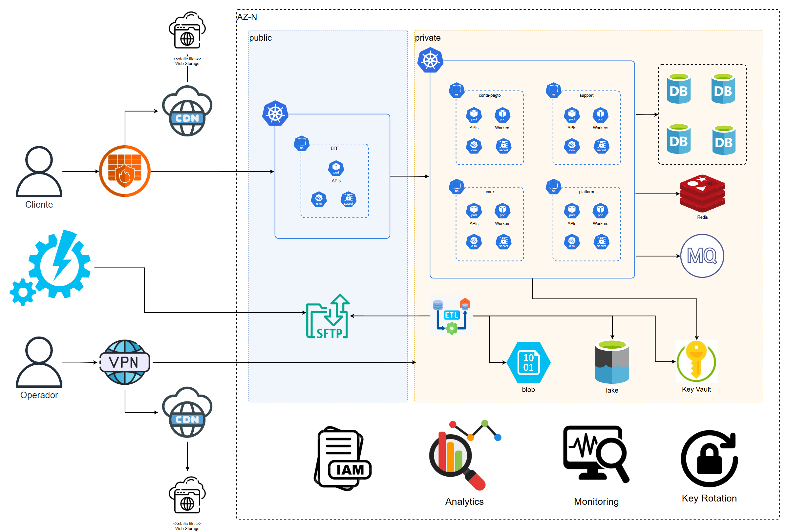
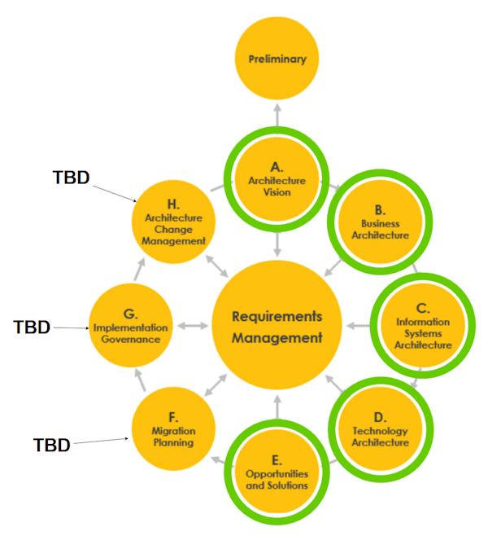

# BancoTeste - Documentação

## 1. Introdução
Este documento apresenta os principais tópicos para o exercício. O banco possui componentes legados e demanda para novos produtos. Arquitetura Corporativa deve avaliar qual produto é mais indicado para o início do desenvolvimento bem como a estruturação para a absorção do legado.

> Este é um exercício e não tem objetivo comercial.

## 2. Requisitos

### 2.1 Funcionais
- Cadastro de clientes
- Autenticação segura 
- Processamento de pagamentos

### 2.2 Não Funcionais
1. **Escalabilidade**: suportar até 10k requisições/segundo  
2. **Disponibilidade**: 99,9% uptime  
3. **Segurança**: criptografia de ponta a ponta
4. **Compliance**: credenciais internas e externas com rotação

## 3. Resumo Executivo – Caso Banco Digital

#### Produto Prioritário:

É recomendada a priorização da Conta de Pagamentos como novo produto, pois cria capacidades fundacionais (ledger, antifraude, KYC/AML) que sustentam futuras ofertas, incluindo Cashback em uma fase seguinte e desacoplamento do legado.

#### Problemas Identificados:

O banco opera com silos de crédito (CDC, consignado, garantias), sem reaproveitamento de dados ou processos. Isso impacta engajamento, escalabilidade e time-to-market de novos produtos.

#### Visão de Arquitetura:

**Domínios Core**: Conta de Pagamentos, Ledger/Escrituração, Antifraude, KYC/AML, IAM, Auditoria & Conformidade.

**Domínios de Suporte**: Tesouraria, Chargeback, Comunicação, Catálogo de Produtos.

**Plataforma**: Observabilidade, Segurança, Analytics, DevOps.

Estilo arquitetural mantido em Microservices.

### Fluxos de Valor Principais:

Criação de Conta: Onboarding (KYC/AML) → IAM → Conta
de Pagamentos.

Operações do Cliente: Orquestração de pagamento → Antifraude → Escrituração
→ Auditoria.

Administração: Tesouraria, Chargeback, Comunicação, Analytics.

Recomendações Estratégicas:

Implantar Conta de Pagamentos como MVP (mínimo produto viável).

Tratar Cashback como Fase 2, consumindo eventos do Core.

Investir em plataforma transversal (Observabilidade, Segurança, Analytics) para acelerar novos produtos.

Estrangular gradualmente os silos legados de crédito, adotando eventos canônicos e camadas anti-corrupção.

## 4. Análise de domínios

Priorizar Conta de Pagamentos como produto core.

Planejar Cashback apenas na Fase 2, consumindo eventos do core.

Investir em Plataforma (Observabilidade, Segurança, Analytics) para sustentar escalabilidade.

> O domínio muda a competição ou só mantém operação?
> Sem ele, paramos de vender ou só perdemos eficiência?
>
> Ele é fonte primária de dados/eventos para muitos outros?
> 
> Requer invariantes fortes/contabilidade/forense?
> 
> Espera-se inovação frequente aqui?
> 
> Há exigências regulatórias diretas?

## 5. Capacidades e Nível de Maturidade

Esta tabela apresenta as principais capacidades do ecossistema, segmentadas em **Core, Support e Platform**, com foco em evolução de maturidade:

**Core (Verde)**: Capacidades essenciais ao negócio, como Conta de Pagamentos, Escrituração, Extrato, Antifraude, KYC e AML. Prioridade máxima para alcançar alta confiabilidade e compliance.

**Support**: Capacidades de suporte crítico, incluindo Auditoria, Tesouraria, Chargeback e Comunicação, visando eficiência operacional e governança.

**Platform**: Capacidades de sustentação tecnológica, como Segurança, Observabilidade, Business Analytics e DevExp, essenciais para escalabilidade e agilidade do desenvolvimento.

**Maturidade**: O estado atual varia de baixa a média, com meta de elevação para nível alto em todas as capacidades estratégicas, garantindo robustez, segurança e evolução contínua.

**Objetivo**: Direcionar investimentos e esforços de desenvolvimento para aumentar a maturidade, priorizando capacidades Core sem negligenciar suporte e plataforma.

## 6. Fluxos de valor primários

Este diagrama apresenta os principais fluxos de valor do MVP, cobrindo etapas críticas para segurança, conformidade e operação. Cada atividade representa um ponto-chave do ciclo de desenvolvimento:

KYC: Garantir identificação segura e aderente às normas.

Antifraude/AML: Implementar monitoramento inteligente e prevenção de riscos.

IAM: Controle robusto de identidade e acessos.

Pagamentos: Fluxo central de transações com integração entre contas OPS e ADM.

Escrituração e Auditoria: Confiabilidade regulatória e rastreabilidade total.

Chargeback, CRC e Analytics: Gestão de disputas, suporte ao cliente e análise de dados para melhoria contínua.

Observabilidade, Segurança e Tesouraria: Sustentação operacional, mitigação de incidentes e governança financeira.

Objetivo: Garantir uma visão macro clara, conectando compliance, experiência do usuário e eficiência operacional, servindo como base para priorização de desenvolvimento e integrações futuras.

## 7. Componentes legado e relacionamento

Os componentes legados, considerando uma solução típica (legacy-solution) deve ter sua integração
por barramento, o qual posteriormente é utilizado para redirecionamento durante o processo de
absorção do legado até que posterioemente desativado.

O Cluster kubernetes deve prever nodes com capacidades diferenciadas para cada necessidade
de processamento. Mais CPU, mais RAM, GPU etc...

## 8. Arquitetura

A quantidade exata de pods, distribuição no cluster, fluxos de comunicação depende do
 aprofundamento da análise de negócios e seus pontos de função.
Aqui temos representada a estrutura macro para uma solução padrão.
Contemplando fluxos síncronos, assíncronos, caching, session etc quando aplicável.

> Diagrama com base em UML - Components

## 9. Considerações Adicionais

Para a sequência das atividades é recomendável:

* Governança para arquitetura corporativa em todas as etapas.

* Utilização de processo ou ferramenta para a continuidade e governança como
por exemplo, LeanIX ou fluxo Jira + Confluence para catálogos e dashboards.

* Definição do backlog para arquitetura.

* Validação dos documentos de requisitos confeccionados pelo time.

* CMDB para o catálogo das soluções e componentes

* Cerimônias multidisciplinares para formalização das soluções.

* Padronização dos diagramas, artefatos e linguagem ubíqua para o time.

* Metodologia Ágil/Scrum aplicada para Arquitetura.

* Artefatos de referência

* Diagramas de solução únicos.

## 10. TOGAF

### Cobertura do exercício

Mapa de Domínios | Phase B (Business Architecture)

Mapa de Capacidades | Capability-Based Planning

Fluxo de Valor | Phase A/B (Vision & Business Architecture)

Arquitetura Alvo (TO-BE) | Phase C/D (Systems & Technology)

Resumo Executivo | Phase A/E (Vision & Opportunities)

